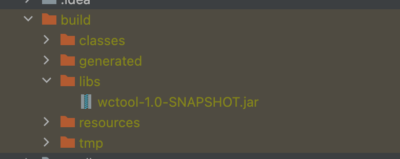

# Build your own WC Tool

This is a simple command-line tool that mimics the basic features of Unix's wc tool. 
The tool is built in Java using [Picocli](https://picocli.info/) and [GraalVM](https://www.graalvm.org/).

This is built as part of John Crickett's [coding challenge](https://codingchallenges.fyi/challenges/challenge-wc/).

## Unix's WC Tool

Before we dive into the tool's usage, let's understand Unix's [wc](https://linux.die.net/man/1/wc) tool.

This tool prints each FILE's word, line, character, and byte counts. 
With no FILE, or when FILE is -, it reads from standard input.

`man wc`

```
wc [OPTION]... [FILE]...
wc [OPTION]... --files0-from=F
Description
Print newline, word, and byte counts for each FILE, and a total line if more than one FILE is specified. With no FILE, or when FILE is -, read standard input.

-c, --bytes
print the byte counts
-m, --chars
print the character counts
-l, --lines
print the newline counts
--files0-from=F
read input from the files specified by NUL-terminated names in file F; If F is - then read names from standard input
-L, --max-line-length
print the length of the longest line
-w, --words
print the word counts
--help
display this help and exit
--version
output version information and exit
```

## WCTool

Like Unix's wc tool, the custom-built tool can also count words, lines, characters and bytes in a file.
It also reads and calculates values of piped input.

While `wc` can work with multiple files, the first version of our custom tool only takes one file.

### Building the tool

Follow the steps to build and create an executable of the tool.

#### Build the jar

1. Clone the project.
2. Run `./gradlew clean build` to build the project
3. This will also create a jar file in the generated build folder.
    

#### Build the native image

We use GraalVM to build our native image. It packages the necessary libraries and JVM to be able to run our executable.

1. Download [GraalVM](https://www.graalvm.org/downloads/).
2. Run `gu install native-image` to install the package.
3. Run `native-image -cp  path/to/picocli-4.7.5.jar:absolute/path/to/wctool/build/libs/wctool-1.0-SNAPSHOT.jar -H:Name=wctool org.com.WCTool` to build and compile a native executable called `wctool`

* `-H:Name=wctool` denotes that our executable will be called wctool.
* `org.com.WCTool` is our Main class. (Since the class is not named Main, we should specify the packages too.)

For more info: https://dev.to/jbebar/native-cli-with-picocli-and-graalvm-566m

### Running the application

You can run the application in two ways, and the example command will show how to count the number of words in the file.

For testing, you can use the [test file](src/main/resources/test.txt) included in the project.

#### Using jar file

We already have the jar file created by building the application. We can use that to run the application.

1. Using a file:

`java -cp path/to/picocli-4.7.5.jar:absolute/path/to/wctool/build/libs/wctool-1.0-SNAPSHOT.jar "org.com.WCTool" -w absolute/path/to/text/file`

2. Passing input as stdin

`cat absolute/path/to/text/file | java -cp path/to/picocli-4.7.5.jar:absolute/path/to/wctool/build/libs/wctool-1.0-SNAPSHOT.jar "org.com.WCTool" -w`

#### Using wctool native image

1. Using a file:

`./wctool -w absolute/path/to/text/file`

2. Passing input as stdin

`cat absolute/path/to/text/file | ./wctool -w`


### wctool usage

```
Usage: wctool [-chlmVw] <input>
A simple WC Tool to print number of words, lines and bytes in a file
<input>     The file/text whose count should be calculated.
-c              calculate number of bytes
-h, --help      Show this help message and exit.
-l              calculate number of lines
-m              calculate number of characters
-V, --version   Print version information and exit.
-w              calculate number of words
```

1. Combine options to get multiple flags to get more values.

`./wctool -wl absolute/path/to/text/file` -> This will display the number of words and lines in the file.

2. Not specifying a flag will calculate all values

`./wctool absolute/path/to/text/file` -> This will display the file's number of words, lines, characters, and bytes.

### Helpers options

Picocli enables the option of displaying a usage document for users to use the document. This can be viewed using:

`./wctool -h` or `./wctool --help`

```
Usage: wctool [-chlmVw] <input>
A simple WC Tool to print number of words, lines and bytes in a file
<input>     The file/text whose count should be calculated.
-c              calculate number of bytes
-h, --help      Show this help message and exit.
-l              calculate number of lines
-m              calculate number of characters
-V, --version   Print version information and exit.
-w              calculate number of words
```

Similarly, we can also get the version of the tool using:

`./wctool -V` or `./wctool --version`

```
1.0.0
```

### Tests

To run tests with a file, please change the file path to an absolute path, as the application only recognizes absolute file paths.
